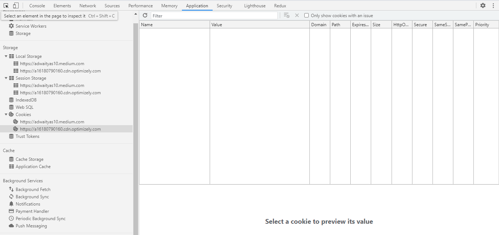
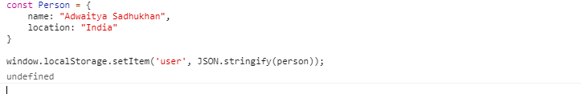

# Local Storage vs Session Storage vs Cookie

Storing data in the various storage options is very useful. But it is very difficult to know which storage option is best for a particular use case. So let’s discuss what are the differences between each option.

**What are Cookies, Local Storage, And Session Storage used for?**\
They all are used to store information on the user’s browser which can be accessed even after navigating to new pages on your site.

This data is also saved to the user’s exact browser they are using so if they have your site open in any browser, it will only save the data to that browser on the device they are currently on.

This means if you open another site later in a different browser the data will no longer be there.



### LocalStorage
localStorage is a way to store data on the client’s computer. It allows the saving of key/value pairs in a web browser and it stores data with no expiration date. localStorage can only be accessed via JavaScript, and HTML5. However, the user has the ability to clear the browser data/cache to erase all localStorage data.

-   Note:
Data in a localStorage object created in a "private browsing" or "incognito" session is cleared when the last "private" tab is closed.

**Pros:**
-   stores data with no expiration date
-   storage limit is about 5MB
-   data is never transferred to the server

**Cons:**
-   plaintext, hence not secure by design
-   limited to string data, hence need to be serialized
-   can only be read on client-side

### Methods and Properties provided by Storage Object

**setItem(key, value)** – store key/value pair.\
**getItem(key)** – get the value by key.\
**removeItem(key)** – remove the key with its value.\
**clear()** – delete everything.\
**key(index)** – get the key on a given position.
**length** – the number of stored items.

### First: setItem()
Just as the name implies, this method allows you to store values in the localStorage object.

It takes two parameters: a key and a value. The key can be referenced later to fetch the value attached to it.

Where name is the key and Abhishek Srivastava is the value. Also note that localStorage can only store strings.

To store arrays or objects, you would have to convert them to strings.

To do this, we use the JSON.stringify() method before passing to setItem().




### Second: getItem()
The getItem() method allows you to access the data stored in the browser’s localStorage object.

It accepts only one parameter which is the key and returns the value as a string.

To retrieve the user key stored above:


This returns a string with value as:

```html
"{\"name\":\"Adwaitya Sadhukhan\",\"location\":\"India\"}"
```

To use this value, you would have to convert it back to an object.

To do this, we make use of the JSON.parse() method, which converts a JSON string into a JavaScript object.


```html
JSON.parse(window.localStorage.getItem('user'));

```

### Third: removeItem()
When passed a key name, the removeItem() method will remove that key from the storage if it exists. If there is no item associated with the given key, this method will do nothing.

### Forth: clear()
This method, when invoked, clears the entire storage of all records for that domain. It does not receive any parameters.

### Fifth: key()
The key method comes in handy in situations where you need to loop through keys and allows you to pass a number or index to localStorage to retrieve the name of the key.

### Sixth: length
The length property returns the number of items stored in the browsers Storage Object, for this particular domain..

The length property belongs to the Storage Object, which can be either a localStorage object or a sessionStorrage object.

## Session storage
-  stores data only for a session, meaning that the data is stored until the browser (or tab) is closed
-   data is never transferred to the server
-   can only be read on client-side
-   storage limit is about 5-10MB
-   opening multiple tabs/windows with the same URL creates sessionStorage for each tab/window

## Cookie
-   Stores data that has to be sent back to the server with subsequent XHR requests. Its expiration varies based on the type and the expiration duration can be set from either server-side or client-side .
-   Cookies are primarily for server-side reading (can also be read on client-side), localStorage and sessionStorage can only be read on client-side.
-   Size must be less than 4KB.
-   Cookies can be made secure by setting the httpOnly flag as true for that cookie. This prevents client-side access to that cookie.


|                                        | `cookie`                                                 | `localStorage` | `sessionStorage` |
| -------------------------------------- | -------------------------------------------------------- | -------------- | ---------------- |
| Initiator                              | Client or server. Server can use `Set-Cookie` header     | Client         | Client           |
| Expiry                                 | Manually set                                             | Forever        | On tab close     |
| Persistent across browser sessions     | Depends on whether expiration is set                     | Yes            | No               |
| Sent to server with every HTTP request | Cookies are automatically being sent via `Cookie` header | No             | No               |
| Capacity (per domain)                  | 4kb                                                      | 5MB            | 5MB              |
| Accessibility                          | Any window                                               | Any window     | Same tab         |


*Note: If the user decides to clear browsing data via whatever mechanism provided by the browser, this will clear out any `cookie`, `localStorage`, or `sessionStorage` stored. It's important to keep this in mind when designing for local persistance, especially when comparing to alternatives such as server side storing in a database or similar (which of course will persist despite user actions).*

<div align="right">
    <b><a href="#">↥ back to top</a></b>
</div>